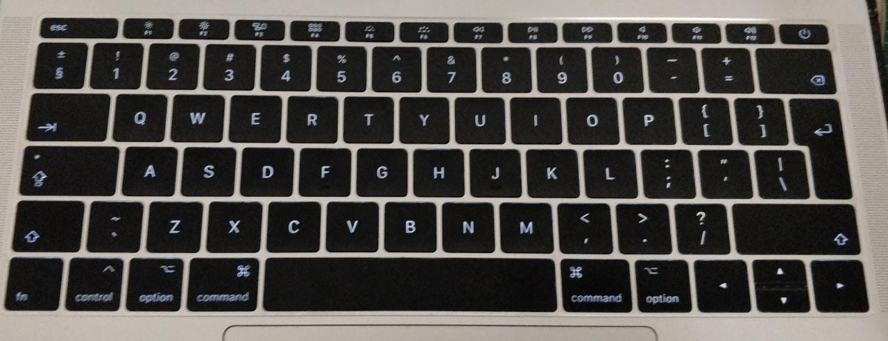

# Vvim - Keyboardless Vim interactions

This is done via a hardware glove that the user wears. The glove detects the
finger's positions and translates them into key presses. It's currently a work
in progress.

### The glove prototype, with 4 sensors on two fingers
Note that the next version is in progress, with 13 sensors per hand:
- 2 flex sensors per finger, 1 force sensor on the fingertip, and one force
  sensor on the thumb


### Subset of data
The stream of data from the 4 sensors (here each shown in a different colour)
has been zeroed so that they all centre around the time when the user pressed
the 'y' key.


## Current Features
- Glove prototype has been constructed.
- Glove can detect finger movements of the right fore finger and right middle
  finger (With space to expand to more fingers if these first two actually
  work)
    - This corresponds to the following keys, shown with how often those keys
      show up in the current dataset: `h`: 628, `u`: 291, `y`: 171, `m`: 171,
      `b`: 155, `k`: 120, `j`:  21, 

- Glove records finger movements via an Arduino script `vvim.ino` on an Uno,
  and sends them to serial output.
- Serial output is read by the python script `glove_logger.py` and saved to the
  file `glove.log` along with the Unix milliseconds since epoch.
- A keylogger is installed on the developer's machine, and logs key presses to
  the file `keys.log` along with Unix milliseconds since epoch.
- Running `cleanup.sh` cleans up the data from the keylogger and the serial
  output into one file named `sorted.log`.
- A Gradient Boosted tree has been trained and saved to `model.pkl`. Currently
  it has a Training Accuracy of 0.986 and a Test Accuracy of 0.813:
    - Currently there are 2883 key press examples in the dataset, as only the
      following keys are counted: `j`, `m`, `n`, `b`, `h`, `y`, `k`, `y`, `u`,
      `i`
    - Adding more sensors will mean that more keystrokes can be tracked, and so
      more training data can be gained from less manual typing
- Each finger has 2 sensors, with space to add an additional sensor per finger
- The file `eda.py` saves plots to `plots/` such as:

## Graphs

Each colour is a differently positioned sensor. Each line is one stream of data
recorded by a sensor. The streams have each been zeroed so that every instance
of pressing a certain key is centred.

#### Keys on the home row
Some keys are easier to spot, and others less so as my fingers move a lot when
pressing a `y` compared to a `k` just because of where the keys are positioned
on the keyboard.


#### More or less data
The data has not been normalised, so there's far more data for when common keys
like `h` are pressed compared to when a `j` is pressed


## In Progress
- Write some sort of visualiser to live track sensor data, actual key presses,
  and predicted key presses. Visualiser should:
    - `tail` the `keys.log` keys.log file and the `glove_measurements.log`
      file, so that the serial USB communication isn't blocked
    - Draw graphs of the sensor data live, displaying the past `n` seconds of
      historical data
    - Use the keylogging data to annotate when the actual key presses are.
    - Some sort of visualisation of what the model (as saved under `model.pkl`)
      is predicting for the current sensor values.
- 3D print a glove to hold everything:
    - This will keep the sensors in place better, resulting in more accurate
      finger measurements
    - If designed properly, it should be less cumbersome to type with than the
      glove
    - The fingertips should be open, as it's tricky to type properly when my
      fingertips can't feel the keys.
    - This should allow for easier expansion into using more sensors
    - Definitely needs to have space for the force sensors

## To Do
- Add a category to allow the glove to predict that no key is being pressed.
- If flex sensors aren't enough to predict exactly when a key is pressed, add
  force sensors to the fingertips.
- Experiment to see if you _really_ need two sensors per finger, or if you can
  get away with just 1 for some fingers
- Use an Arduino Nano 3.3v BLE because:
    - Small enough to have one on each hand
    - Can connect via BlueTooth instead of via wires
    - They also contain an IMU, so hand acceleration can be measured which will
      improve accuracy for keys further from the home row.
- Current models don't have the option of categorizing an sequence of sensor
  readings as not pressing any key at all. This should be fixed so the model
  isn't constantly assuming at least one key is being pressed
    - This could be done easily with pressure sensors

## Keys and which finger tends to press them
Note that this list is likely very specific to the author, as different people
will type differently. I think I probably use my right ring finger much more
than I really should. Also I type a `y` with my index finger for words like
`type` or `you` (where I subsequently have to type another letter with me right
hand), but I type it with my middle finger for words like `yes`, `yank`, or
`keyboard`.

- Right Hand
    - Thumb: `space`
    - Index: `j`, `m`, `n`, `b`, `h`, `y`
    - Middle: `k`, `y`, `u`, `i`, `<`, `(`, `[` 
    - Ring: `l`, `:`, `BACKSPACE`, `o`, `p`, `>`, `)`, `]`, `0`, `_`, `-`, `+`, `=`, `,`, `.`
    - Pinky: `;`, `ENTER`, `/`, `?`
- Left Hand (Incomplete as I've not yet built a glove for the left hand)
    - Pinky: 
    - Ring:
    - Middle: 
    - Index: 
    - Thumb: 

Here's a picture of my keyboard for reference:


## How to Start Recording Data
Probably best to do this all in `tmux` since handling multiple terminal windows
is a pain otherwise. A keylogger (I use [Casey Scarborough's
keylogger](https://github.com/caseyscarborough/keylogger)) is also required.

0. Install requirements
``` 
pip3 install -r requirements.txt
```

1. Run the command to clear the logfile:
``` 
sudo keylogger clear
```

2. Start the keylogger:
``` 
sudo keylogger ./keys.log
```

3. Start recording glove movements:
``` 
python3 glove_logger.py
```

4. Put the glove on, and start typing things out. I usually do this by opening
   a text file (like Alice in Wonderland available on Gutenberg) in vim (`vim
   alice.txt`), and then splitting the window vertically (`:vsp`), and then
   opening a temporary file in which to type in (`:e tmp`). Finally, type
   (`:set cursorbind`) into both frames so that the source text scrolls as you
   type it.  They keystrokes and finger movements will be recorded separately

5. Remove the glove

6. Stop the keylogger with `CTRL-C`

7. Stop recording the finger movements with `CTRL-C`

8. Now the data is recorded, clean it up:
```
./cleanup.sh
```

9. And analyse the data with `eda.py`
```
python3 eda.py
```
The images will be stored to `plots/` for your viewing pleasure

## License
This work is licensed under GNU GPLv3. See the attached LICENSE. See
https://choosealicense.com/licenses/gpl-3.0/# for a non-legalese explanation of
the license.

