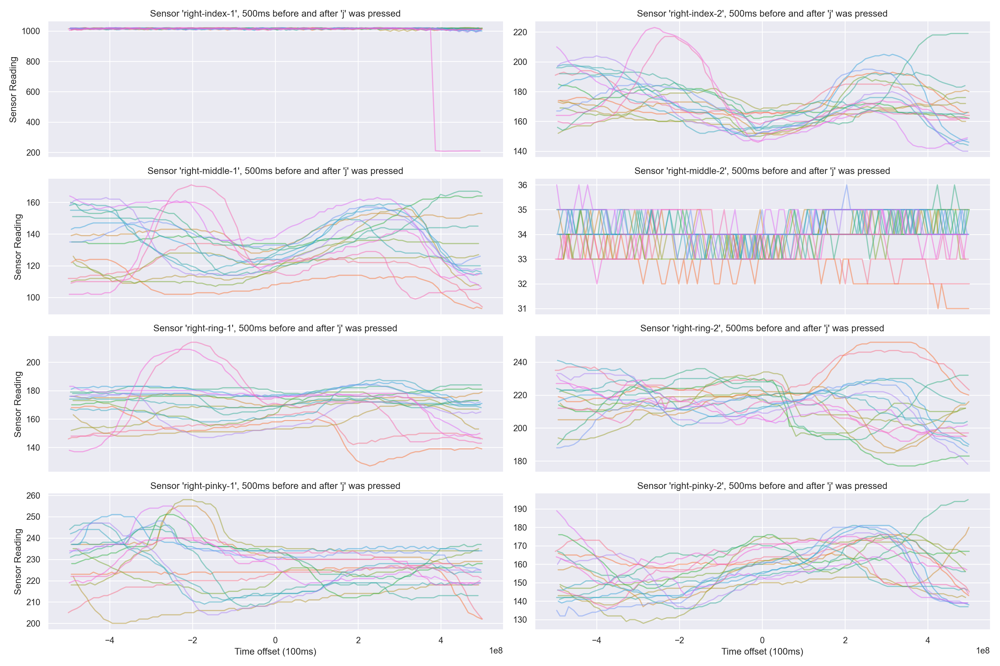
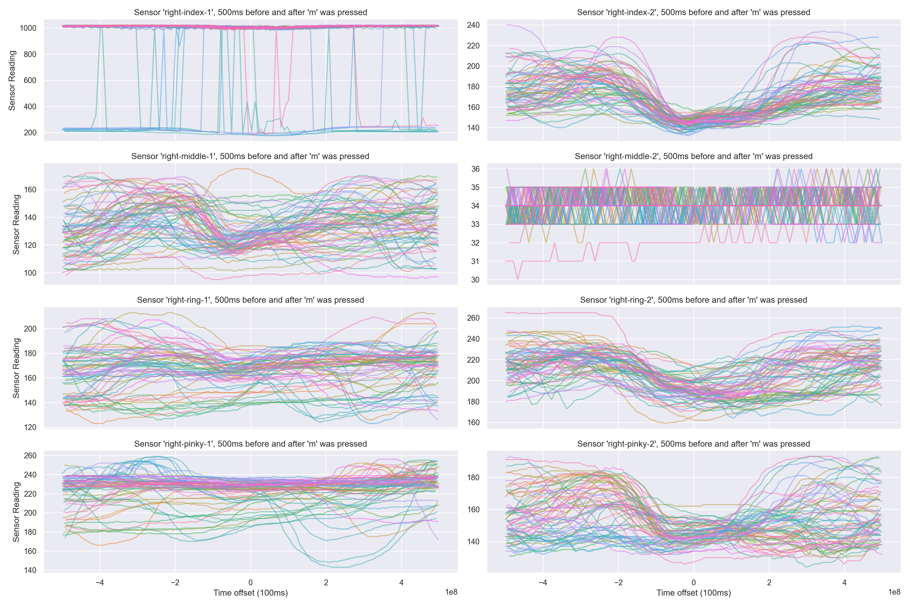

# Vvim - Keyboardless Vim interactions

This is done via a hardware glove that the user wears. The glove detects the
finger's positions and translates them into key presses. It's currently a work
in progress.

### The glove prototype, with 4 sensors on two fingers


### Subset of data
The stream of data from the 4 sensors (here each shown in a different colour)
has been zeroed so that they all centre around the time when the user pressed
the 'y' key.


## Current Features
- Glove prototype has been constructed.
- Glove can detect finger movements of the right fore finger and right middle
  finger (With space to expand to more fingers if these first two actually
  work)
    - This corresponds to the following keys: `b`, `h`, `i`, `j`, `k`, `m`,
      `n`, `u`, `y`.
- Glove records finger movements via an Arduino script `vvim.ino` on an Uno,
  and sends them to serial output.
- Serial output is read by the python script `glove_logger.py` and saved to the
  file `glove.log` along with the Unix milliseconds since epoch.
- A keylogger is installed on the developer's machine, and logs key presses to
  the file `keys.log` along with Unix milliseconds since epoch.
- Running `cleanup.sh` cleans up the data from the keylogger and the serial
  output into one file named `sorted.log`.
- The file `eda.py` saves plots to `plots/` such as:

## Sensor data 
Each colour is a differently positioned sensor. Each line is one stream of data
recorded by a sensor. The streams have each been zeroed so that every instance
of pressing a certain key is centred.

#### Keys on the home row
Some keys are easier to spot, and others less so as my fingers move a lot when
pressing a `y` compared to a `k` just because of where the keys are positioned
on the keyboard.


#### More or less data
The data has not been normalised, so there's far more data for when common keys
like `h` are pressed compared to when a `j` is pressed




## In Progress
- Use the collected data to train a prediction model for just the two fingers
- Expand to collect more data from more fingers.
- If flex sensors aren't enough to predict exactly when a key is pressed, add
  force sensors to the fingertips.

## To Do
- Use an Arduino Nano instead of an Uno, and host the entire thing on the
  user's hand
- Connect the glove to the computer via Bluetooth, instead of a wired
  connection


## How to Start Recording Data
1. Run the command to clear the logfile:
``` 
sudo keylogger clear
```

2. Start the keylogger:
``` 
sudo keylogger
```


3. Start recording glove movements:
``` 
# This hasn't been figured out yet, but the follwing
#  command will use `screen` to view the serial output:
screen /dev/cu.usbmodem141101 9600
``

4. Put the glove on, and start typing things out. They keystrokes and finger
   movements will be recorded separately

5. Remove the glove, 

6. Stop recording the finger movements

7. Stop the keylogger with `CTRL-C`:

8. And you're done. The data will be stored until you start recording again.


# License
This work is licensed under GNU GPLv3. See the attached LICENSE. See
https://choosealicense.com/licenses/gpl-3.0/# for a non-legalese explanation of
the license.

